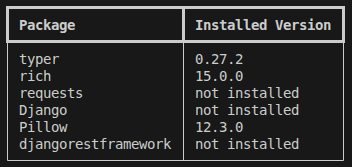

# Dependency Checker



Checks which packages from `requirements.txt` are installed in the current environment.

```bash
python -m venv .venv
source .venv/bin/activate
pip install -e .
deps-check check requirements.txt
```
